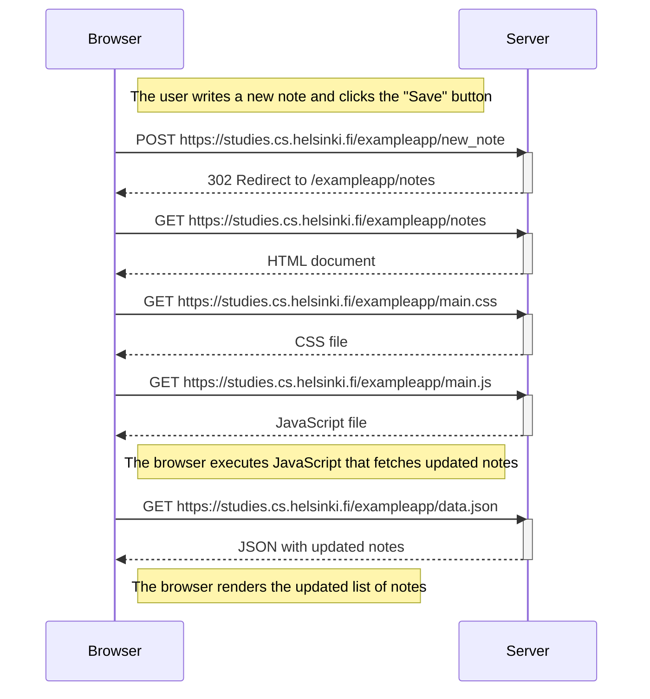

## ✍️ New Note Flow – Mermaid Sequence Diagram

```mermaid
sequenceDiagram
    participant Browser
    participant Server

    Note right of Browser: The user writes a new note and clicks the "Save" button

    Browser->>Server: POST https://studies.cs.helsinki.fi/exampleapp/new_note
    activate Server
    Server-->>Browser: 302 Redirect to /exampleapp/notes
    deactivate Server

    Browser->>Server: GET https://studies.cs.helsinki.fi/exampleapp/notes
    activate Server
    Server-->>Browser: HTML document
    deactivate Server

    Browser->>Server: GET https://studies.cs.helsinki.fi/exampleapp/main.css
    activate Server
    Server-->>Browser: CSS file
    deactivate Server

    Browser->>Server: GET https://studies.cs.helsinki.fi/exampleapp/main.js
    activate Server
    Server-->>Browser: JavaScript file
    deactivate Server

    Note right of Browser: The browser executes JavaScript that fetches updated notes

    Browser->>Server: GET https://studies.cs.helsinki.fi/exampleapp/data.json
    activate Server
    Server-->>Browser: JSON with updated notes
    deactivate Server

    Note right of Browser: The browser renders the updated list of notes

```