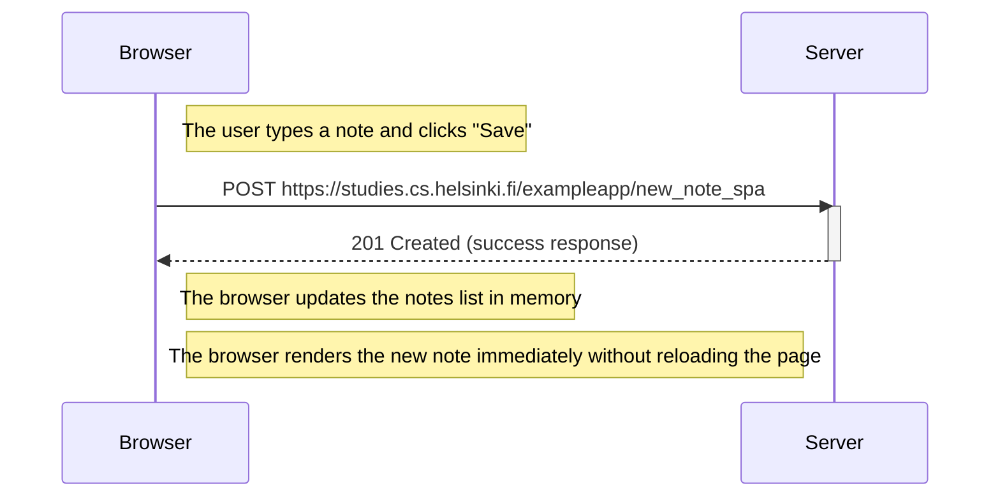

```mermaid
sequenceDiagram
    participant Browser
    participant Server

    Note right of Browser: The user types a note and clicks "Save"

    Browser->>Server: POST https://studies.cs.helsinki.fi/exampleapp/new_note_spa
    activate Server
    Server-->>Browser: 201 Created (success response)
    deactivate Server

    Note right of Browser: The browser updates the notes list in memory

    Note right of Browser: The browser renders the new note immediately without reloading the page
```